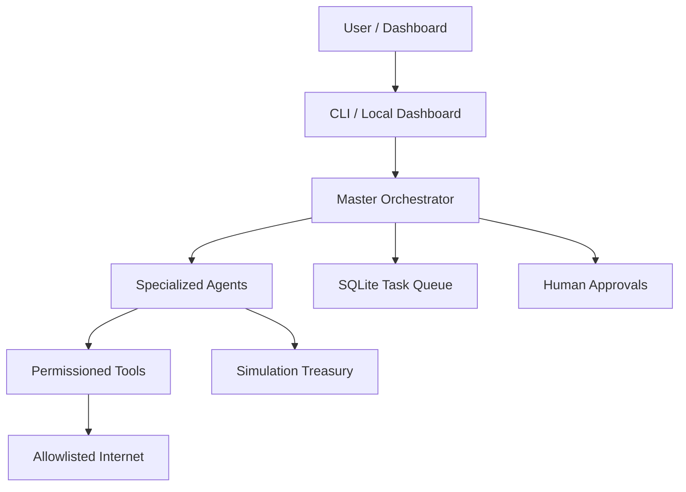
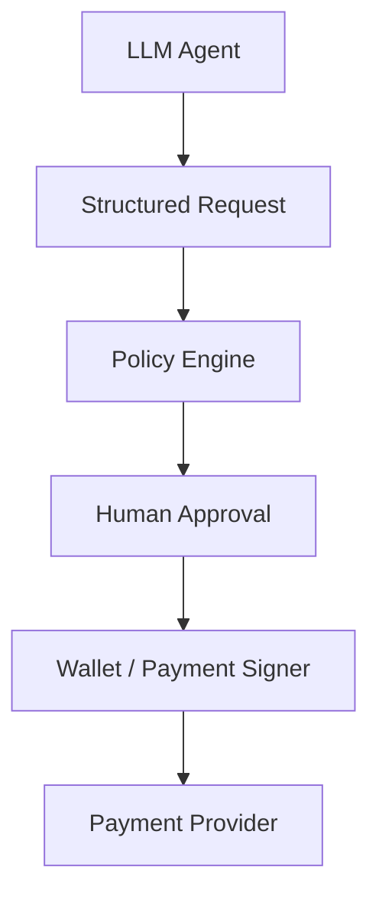

# Autonomous Agent Economy

Controlled local AI-agent economy for researching, building, testing, and preparing legitimate digital products with a simulation treasury, human approvals, and Ollama as the default local LLM provider.

**Status:** MVP, local-first, simulation-first.  
**Security warning:** real payments, wallet signing, marketplace publication, and external account actions are blocked behind policy and human approval. Never put private keys, seed phrases, or wallet passwords into prompts.

## What It Does

- Runs a controlled agent loop locally.
- Uses Ollama by default with `qwen2.5:7b` for Apple Silicon / 16 GB class machines.
- Stores state in SQLite so tasks survive restart.
- Simulates revenue, expenses, sales, and budget allocation with no wallet required.
- Scores product ideas and runs a demo product cycle.
- Enforces budget, domain, tool, approval, and kill-switch controls.
- Provides a CLI and a local-only FastAPI dashboard.

## Quick Start

```bash
git clone <your-repo-url>
cd autonomous-agent-economy
./setup.sh
. .venv/bin/activate
agent-economy demo
agent-economy dashboard
```

Windows:

```powershell
git clone <your-repo-url>
cd autonomous-agent-economy
.\setup.ps1
.\.venv\Scripts\Activate.ps1
agent-economy demo
```

## Requirements

- Python 3.12+
- Git
- Ollama for local model execution
- Optional: Docker

## Architecture



## Simulation Mode

Simulation mode is the default. It starts with 1000 simulation credits, records simulated sales, and allows the full workflow without real money or wallets.

```bash
agent-economy simulation
agent-economy treasury status
```

## Ollama

Default model profile:

- `small`: `llama3.2:3b`
- `balanced`: `qwen2.5:7b`
- `powerful`: `llama3.1:8b`

Install Ollama from <https://ollama.com/download>, then run:

```bash
ollama pull qwen2.5:7b
agent-economy doctor
```

## CLI

```bash
agent-economy setup
agent-economy doctor
agent-economy demo
agent-economy start
agent-economy stop --all
agent-economy status
agent-economy dashboard
agent-economy agents list
agent-economy tasks list
agent-economy approvals list
agent-economy approvals approve <id>
agent-economy approvals reject <id>
agent-economy treasury status
```

## 24/7 Mode

The system can install OS service templates:

```bash
scripts/install_launchd.sh        # macOS
scripts/install_systemd.sh        # Linux
powershell scripts/install_windows_task.ps1
```

The computer must be on. Sleep or standby can stop background processes.

## Security Model

The LLM never receives private keys. It can only create structured requests. Policy and approvals decide whether anything risky moves forward.



Real providers are intentionally not enabled by default.

## Beginner Explanation

Ollama is an app that runs AI models on your own computer. An LLM is the text AI model itself. An agent is a program that uses an LLM plus tools to work on a goal. The master-agent decides what should happen next, while sub-agents handle jobs like research, building, testing, marketing, finance, or security.

The treasury is the project wallet/accounting brain. In simulation mode it is fake money, so you can test the full system without paying anything. The AI does not get your private key because private keys can move real money. Instead, the AI can only ask for a transaction. The policy engine and you decide if it is allowed.

Products are created through a pipeline: research, idea, scoring, planning, building, testing, review, approval, publishing, analytics, and improvement. In the MVP, publishing and sales are simulated. Later you can connect real marketplaces that have official APIs, but publication still needs approval unless you explicitly configure otherwise.

Reinvestment means part of the simulated or real revenue can be reserved for better models or compute. The system may suggest an upgrade, but it cannot buy anything by itself. New agents are logical worker profiles with strict limits, not uncontrolled self-copying software.

For 24/7 operation, install the service for your OS. After a restart, SQLite keeps tasks, approvals, transactions, and settings. You still need to configure real APIs, marketplace accounts, tax/legal setup, and payment providers yourself. The system must not automatically bypass KYC, captchas, rate limits, platform rules, copyright, or safety limits.

## Development

```bash
pip install -e ".[dev]"
ruff check .
mypy src
pytest
```

## Limitations

- Real marketplace and payment providers are abstractions only.
- Ollama must be installed separately on some systems.
- Dashboard is intentionally local-only.
- This software does not guarantee profit.

## License

MIT. It is simple and friendly for public open-source use.
